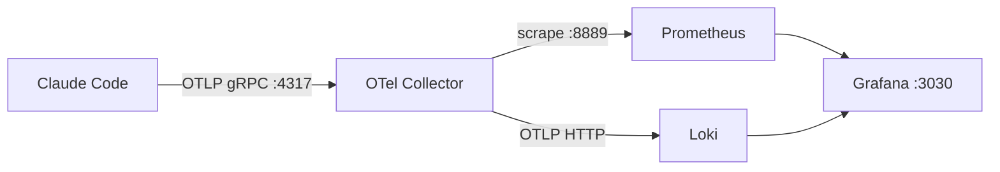
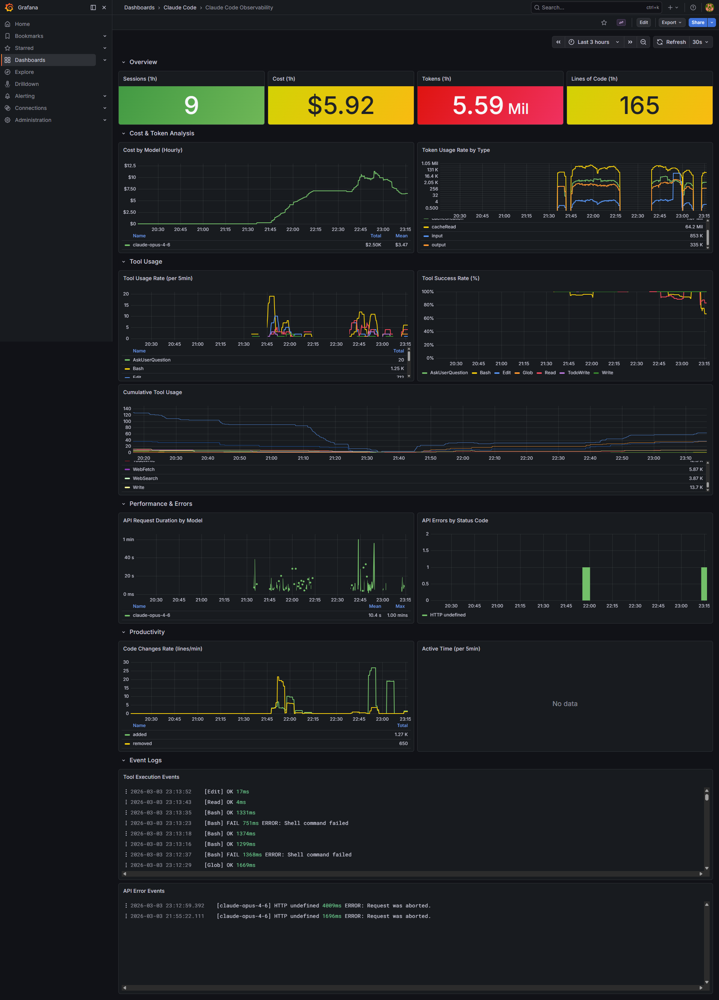

# claude-code-monitoring

Claude Code 세션의 메트릭과 로그를 수집·시각화하는 OpenTelemetry 기반 모니터링 스택.

## Architecture



| Service | Port | Role |
|---------|------|------|
| OTel Collector | 4317 (gRPC), 4318 (HTTP), 8889 | OTLP 수신, 메트릭/로그 분배 |
| Prometheus | 9090 | 메트릭 저장 (30일 보존) |
| Loki | 3100 | 로그 저장 |
| Grafana | 3030 | 대시보드 |

## Quick Start

### 1. 스택 실행

```bash
docker compose up -d
```

### 2. Claude Code 텔레메트리 활성화

`~/.claude/settings.json`에 추가:

```json
{
  "env": {
    "CLAUDE_CODE_ENABLE_TELEMETRY": "1",
    "OTEL_METRICS_EXPORTER": "otlp",
    "OTEL_LOGS_EXPORTER": "otlp",
    "OTEL_EXPORTER_OTLP_PROTOCOL": "grpc",
    "OTEL_EXPORTER_OTLP_ENDPOINT": "http://localhost:4317",
    "OTEL_METRIC_EXPORT_INTERVAL": "60000"
  }
}
```

### 3. 대시보드 확인

http://localhost:3030 → Claude Code Observability 대시보드



### 4. 헬스체크

```bash
bash scripts/healthcheck.sh
```

## Collected Data

### Metrics (Prometheus)

| Metric | Description |
|--------|-------------|
| `claude_code_session_count_total` | 세션 수 |
| `claude_code_cost_usage_USD_total` | 모델별 비용 |
| `claude_code_token_usage_tokens_total` | 토큰 사용량 (input/output) |
| `claude_code_lines_of_code_count_total` | 코드 변경량 (added/removed) |
| `claude_code_active_time_seconds_total` | 활성 시간 |

### Log Events (Loki)

| Event | Key Attributes |
|-------|---------------|
| `claude_code.tool_result` | tool_name, success, duration_ms |
| `claude_code.api_request` | model, duration_ms, tokens |
| `claude_code.api_error` | status_code, error, model |

## Troubleshooting

```bash
# 전체 헬스체크
bash scripts/healthcheck.sh

# Prometheus에서 메트릭 직접 조회
curl -s 'http://localhost:9090/api/v1/query?query=claude_code_session_count_total'

# Loki에서 로그 직접 조회
curl -s 'http://localhost:3100/loki/api/v1/query?query={service_name="claude-code"}'
```

자세한 트러블슈팅 가이드: [docs/architecture.md](docs/architecture.md#트러블슈팅)